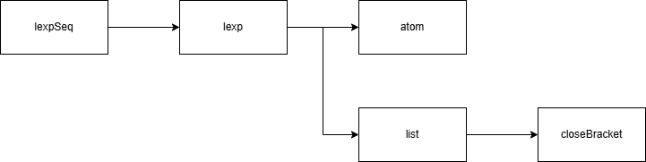
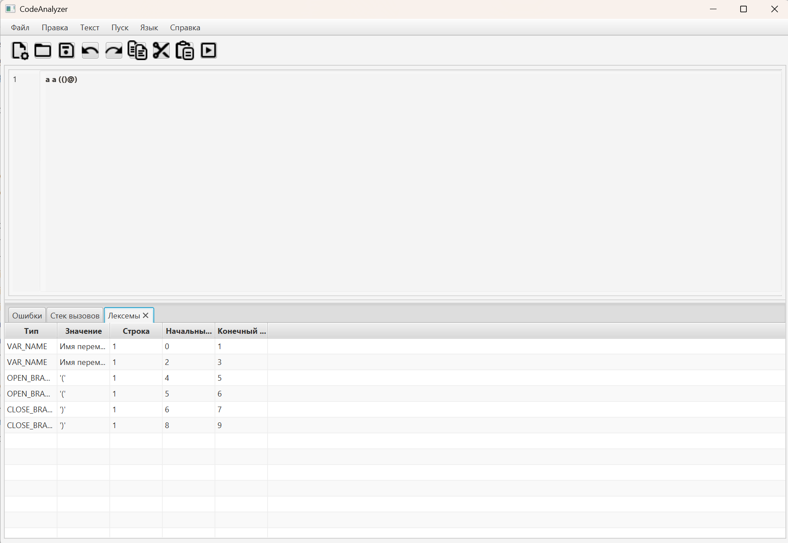
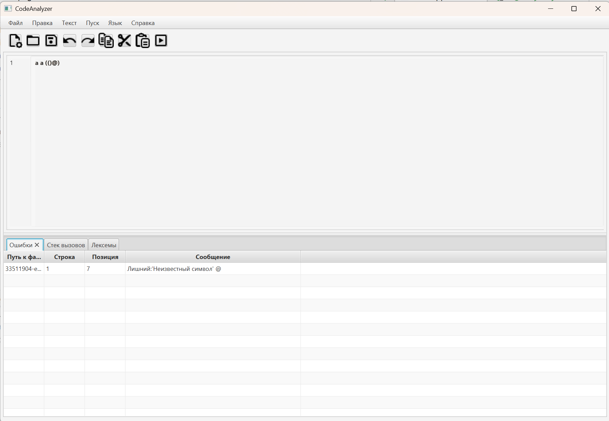
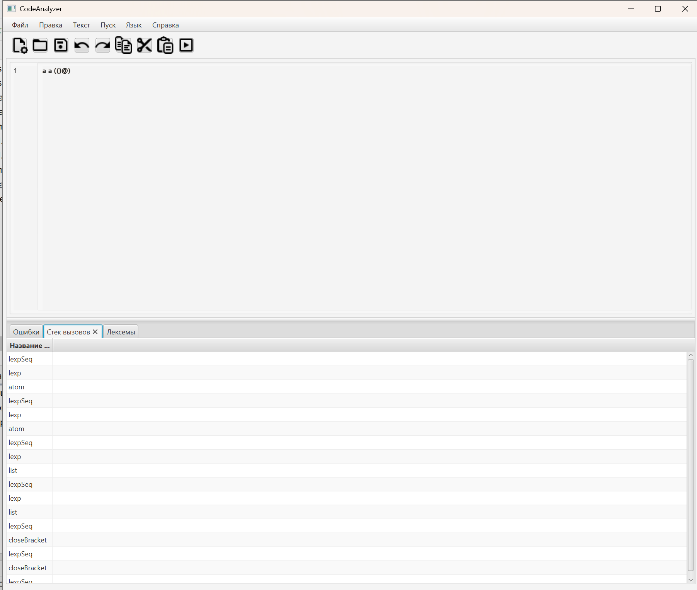
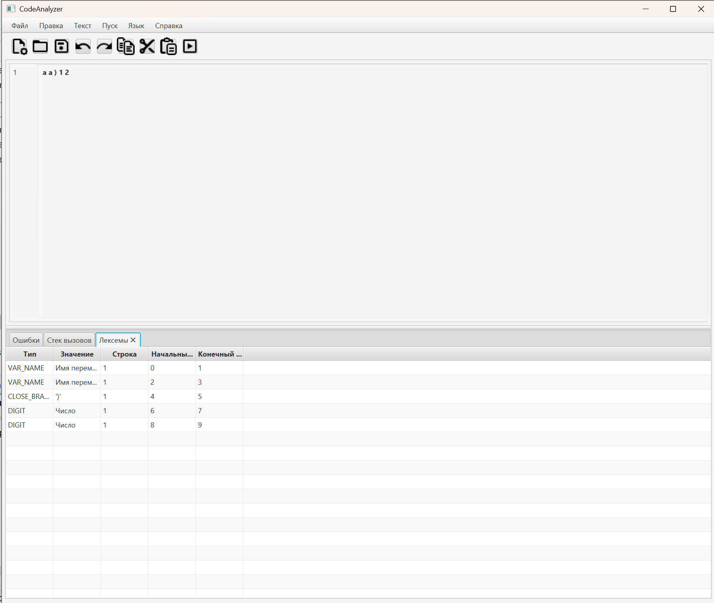
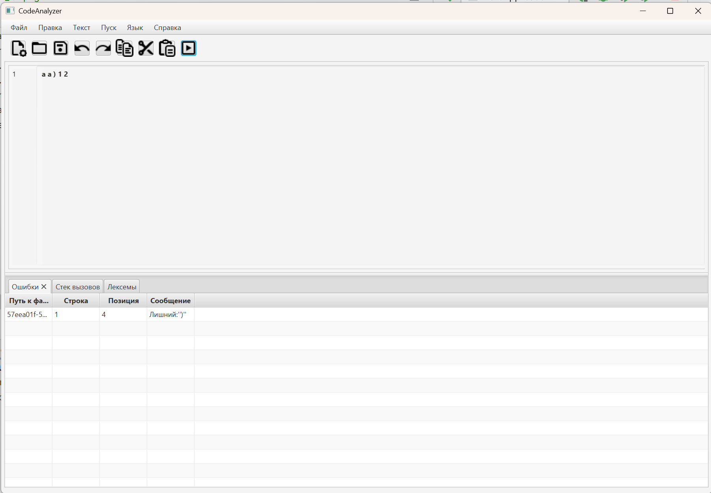
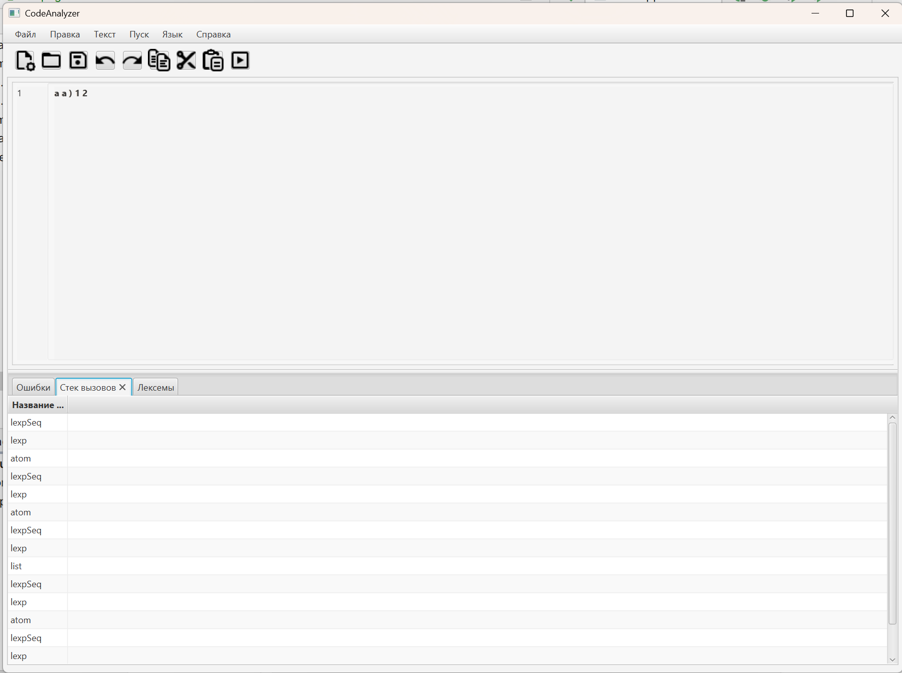

# Лабораторная работа 8

## Задание
**Тема лабораторной работы:** Реализация метода рекурсивного спуска для синтаксического анализа.

**Цель работы:** Разработать для грамматики алгоритм синтаксического анализа на основе метода рекурсивного спуска.

**Задание:** В соответствии с вариантом для заданной грамматики необходимо разработать и реализовать алгоритм синтаксического анализа на основе метода рекурсивного спуска.

В окне результатов отражается последовательность вызова процедур обработки символов грамматики в соответствии с деревом рекурсивного спуска. При наличии ошибки разбор продолжается с вышестоящего по отношению к ошибочному узлу куста.

**Вариант 29:** 
Для грамматики G[Lexp-seq] разработать и реализовать алгоритм
анализа на основе метода рекурсивного спуска.
1. Lexp-seq ::= Lexp-seq Lexp | Lexp
2. Lexp ::= Atom | List
3. Atom ::= „number‟ | „identifier‟
4. List ::= „(‟ Lexp-seq „)‟
   Примечание: данная грамматика порождает цепочки упрощенного
   языка Lisp.

## Классификация
Данная грамматика по хомскому принадлежит к классу контекстно свободных грамматик

## Диаграмма сканера

  
   
  <strong>Рис. 1:</strong> Диаграмма сканнера

## Схема вызова функций

  
   
  <strong>Рис. 2:</strong> Схема вызова функций

## Тестовые примеры

  
   
  <strong>Рис. 3:</strong>Пример 1 Лексический анализ

  
   
  <strong>Рис. 4:</strong>Пример 1 Ошибки

  
   
  <strong>Рис. 5:</strong>Пример 1 Стэк вызовов

  
   
  <strong>Рис. 6:</strong>Пример 2 Лексический анализ

  
   
  <strong>Рис. 7:</strong>Пример 2 Ошибки

  
   
  <strong>Рис. 8:</strong>Пример 2 Стэк вызовов

