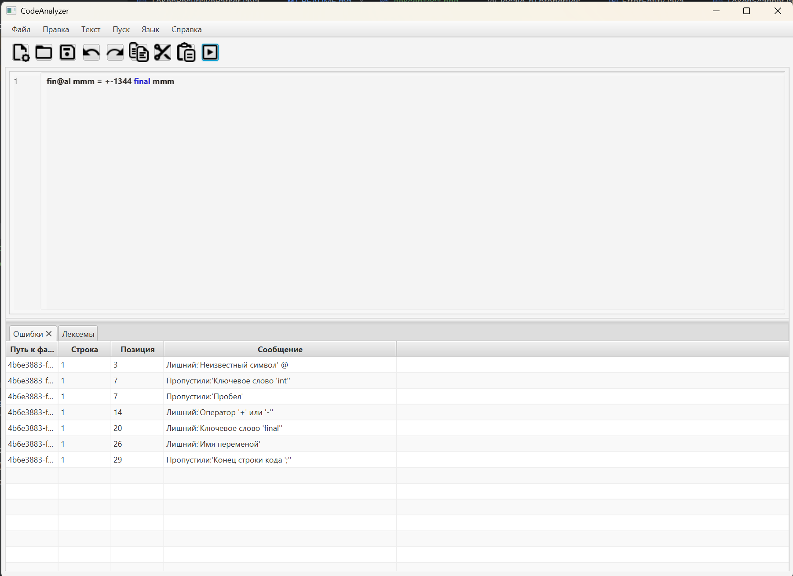

## Вариант задания

Объявление целочисленной константы с инициализацией на
языке Java

## Примеры допустимых строк

```
final int a=123;
final int a=+123;
final int a=-123;
final int a=-000123;
```
## Грамматика

1. `<START> -> 'final' <SPACE_AFTER_FINAL>`
2. `<SPACE_AFTER_FINAL> -> ' ' <TYPE>`
3. `<TYPE> -> 'int' <SPACE_AFTER_TYPE>`
4. `<SPACE_AFTER_TYPE> -> ' ' <VAR>`
5. `<VAR> -> first_symb <VARREM>`
6. `<VARREM> -> symb <VARREM>`
7. `<VARREM> -> '=' <NUMBER>`
8. `<NUMBER> -> "+" <INT>`
9. `<NUMBER> -> "-" <INT>`
10. `<INT> -> digit <INTREM>`
11. `<NUMBER> -> digit <INTREM>`
12. `<INTREM> -> digit <INTREM>`
13. `<INTREM> -> ';'`
- `digit` → `1` | `2` | ... | `9` | `0`
- `first_symb` → `a` | `b` | ... | `z` | `A` | `B` | ... | `Z`
- `symb` → `a` | ... | `z` | `A` | ... | `Z` | `1` | ... | `9`

## Классификация грамматики
Согласно классификации Хомского, грамматика G[‹START›] является автоматной.
Правила (1)-(13) относятся к классу праворекурсивных продукций (A → aB | a | ε):

Правила продукции:
1. `<START>` → `'final'` `<SPACE_AFTER_FINAL>`
2. `<SPACE_AFTER_FINAL>` → `' '` `<TYPE>`
3. `<TYPE>` → `'int'` `<SPACE_AFTER_TYPE>`
4. `<SPACE_AFTER_TYPE>` → `' '` `<VAR>`
5. `<VAR>` → `first_symb` `<VARREM>`
6. `<VARREM>` → `symb` `<VARREM>`
7. `<VARREM>` → `'='` `<NUMBER>`
8. `<NUMBER>` → `"+"` `<INT>`
9. `<NUMBER>` → `"-"` `<INT>`
10. `<INT>` → `digit` `<INTREM>`
11. `<NUMBER>` → `digit` `<INTREM>`
12. `<INTREM>` → `digit` `<INTREM>`
13. `<INTREM>` → `';'`
**Примечания:**
- Все продукции строго праворекурсивны (форма `A → aB | a | ε`).
- Терминалы заключены в кавычки (например `'int'`), нетерминалы — в угловые скобки.
- Отсутствует смешение лево- и праворекурсивных правил.

## Диаграмма состояний сканнера


## Тестовый пример лексер


## Граф конечного автомата


## Граф вызова проуедур


## Тестовые примеры парсера





## Справка по текстовому редактору

### Пункты меню

- Файл → Создать (Ctrl+N) -  Создает новую вкладку с пустым текстовым файлом. Имя файла по умолчанию — "NewFileN.txt", где N — номер следующего файла.
- Файл → Открыть (Ctrl+O) - Открывает диалог для выбора текстового файла, который затем отображается в новой вкладке с именем файла.
- Файл → Сохранить (Ctrl+S) - Сохраняет содержимое текущей вкладки. Если файл уже имеет путь, сохраняет по нему; иначе открывает диалог "Сохранить как".
- Файл → Сохранить как - Открывает диалог для сохранения текущей вкладки под новым именем и в новом месте.
- Файл → Выход - Закрывает приложение с запросом сохранения всех измененных вкладок.
- Правка → Отменить - Отменяет последнее действие в текущей вкладке (например, удаление текста).
- Правка → Повторить - Повторяет отмененное действие в текущей вкладке.
- Правка → Вырезать - Вырезает выделенный текст из текущей вкладки в буфер обмена.
- Правка → Копировать - Копирует выделенный текст в буфер обмена.
- Правка → Вставить - Вставляет текст из буфера обмена в текущую вкладку.
- Правка → Удалить - Удаляет выделенный текст в текущей вкладке.
- Правка → Выделить все - Выделяет весь текст в текущей вкладке.
- Пуск - Запуск парсера, пока не реализован.
- Справка → Справка - Открывает этот документ с описанием функций приложения.
- Справка → О программе - Показывает окно с информацией о программе (версия, автор).

### Область ввода текста
Область ввода текста расположена в центральной части окна и представлена вкладками. Каждая вкладка соответствует открытому файлу и содержит:

- Номера строк - Слева от текста отображаются номера строк, которые автоматически обновляются при добавлении или удалении строк. Прокрутка номеров синхронизирована с текстом.
- Текстовый редактор - Основная область для ввода и редактирования текста. Поддерживает многострочный ввод, табуляцию и прокрутку при превышении видимой области.
- Закрытие вкладки - Крестик "×" на заголовке вкладки позволяет закрыть её с запросом сохранения изменений, если они есть.

Перетаскивание файла из проводника в область ввода открывает его как новую вкладку. Размер шрифта текста можно изменять через меню "Текст".